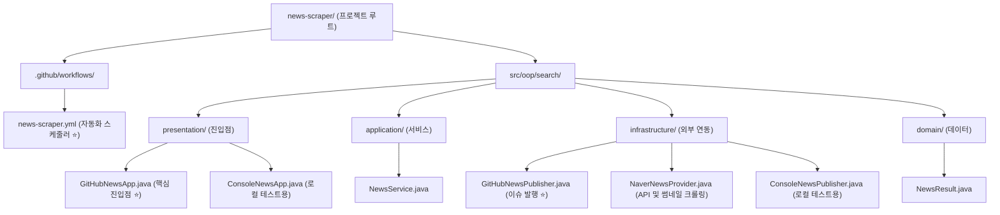

# 뉴스 스크래퍼(News Scraper) 프로젝트 구조

이 프로젝트의 **가장 핵심적인 기능**은 GitHub Actions 스케줄러를 통해 서버 없이 자동으로 뉴스를 스크래핑하고, 수집된 결과를 저장소의 **이슈(Issue)로 예쁘게 브리핑(발행)** 하는 것입니다. (콘솔 실행 기능은 개발 중 보조적인 테스트 용도입니다.)

## 🎯 핵심 워크플로우 (GitHub Actions)
1. **`news-scraper.yml`**: 지정된 시간에 서버를 띄워 **`GitHubNewsApp`**을 실행시킵니다.
2. **`GitHubNewsApp`**: 저장소의 Secrets에 등록된 API 키를 읽고, **`NewsService`**를 가동시킵니다.
3. **`NaverNewsProvider`**: 네이버 API 검색 및 기사 원문 HTML 파싱을 통해 썸네일까지 확보한 **`NewsResult`** 데이터를 생성합니다.
4. **`GitHubNewsPublisher`**: 데이터를 가독성 높은 카드형 마크다운으로 조립한 뒤, GitHub API에 POST 요청을 보내 최종적으로 **이슈(Issue)를 등록**합니다.

---

## 🏗 클린 아키텍처 계층(Layer) 요약
* **`domain`**: 뉴스 데이터의 뼈대(`NewsResult`, `NewsCategory`)를 정의합니다. 외부 환경에 얽매이지 않는 가장 순수한 계층입니다.
* **`application`**: 데이터 흐름(검색 -> 발행)을 통제하는 오케스트레이션 로직(`NewsService`, 인터페이스)을 담당합니다.
* **`infrastructure`**: 외부 네이버 API 통신, OG 태그 크롤링, GitHub API 호출 등 복잡한 기술적 구현체를 담당합니다.
* **`presentation`**: 콘솔 화면이나 자동화 스크립트에서 프로그램이 최초로 구동되는 진입점을 담당합니다.
