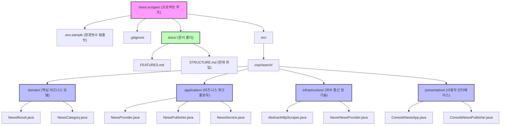

# 뉴스 스크래퍼(News Scraper) 프로젝트 구조

아래는 Mermaid를 활용하여 현재 `news-scraper` 프로젝트의 디렉토리와 주요 파일 구조를 시각화한 다이어그램입니다. 각 패키지(클린 아키텍처 계층)별로 파일들이 어떻게 분류되어 있는지 한눈에 파악할 수 있습니다.

## 계층(Layer) 요약 설명
- **`domain`**: 뉴스 데이터 자체의 규격과 기준(`NewsResult`, `NewsCategory`)을 정의합니다. 외부 환경에 영향을 받지 않는 가장 순수한 계층입니다.
- **`application`**: 도메인을 활용하여 뉴스를 검색하고 발행하는 핵심적인 작업 흐름(인터페이스 및 `NewsService`)을 정의합니다.
- **`infrastructure`**: 외부 네이버 API와의 실제 네트워크 통신 등 구체적인 기술 구현(`NaverNewsProvider` 등)을 담당합니다.
- **`presentation`**: 사용자와 직접 맞닿는 콘솔 입출력(`ConsoleNewsApp`, `ConsoleNewsPublisher`)을 담당합니다.
